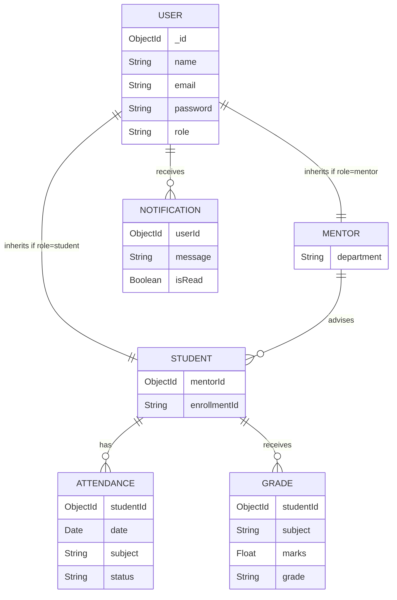
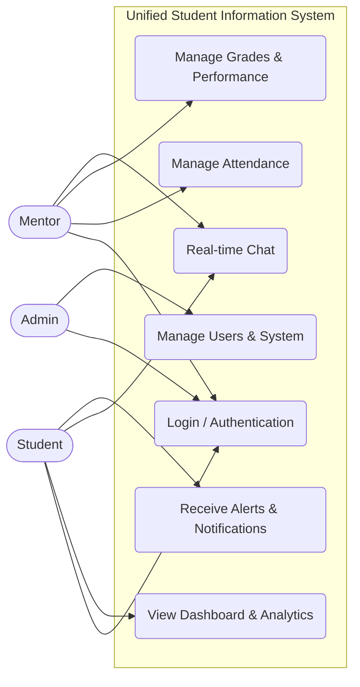
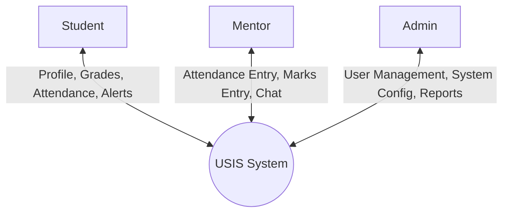
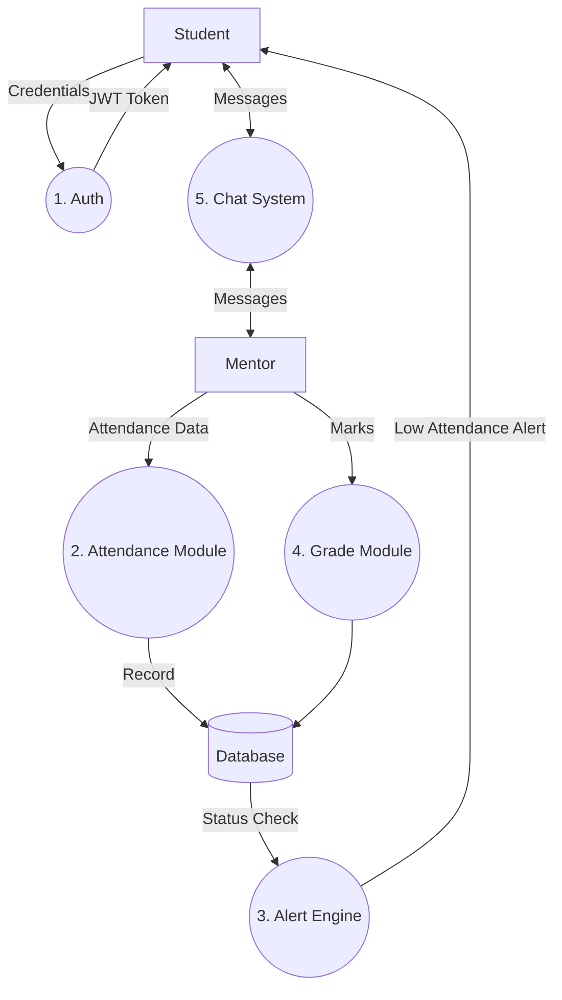
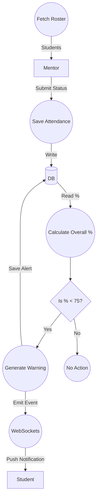
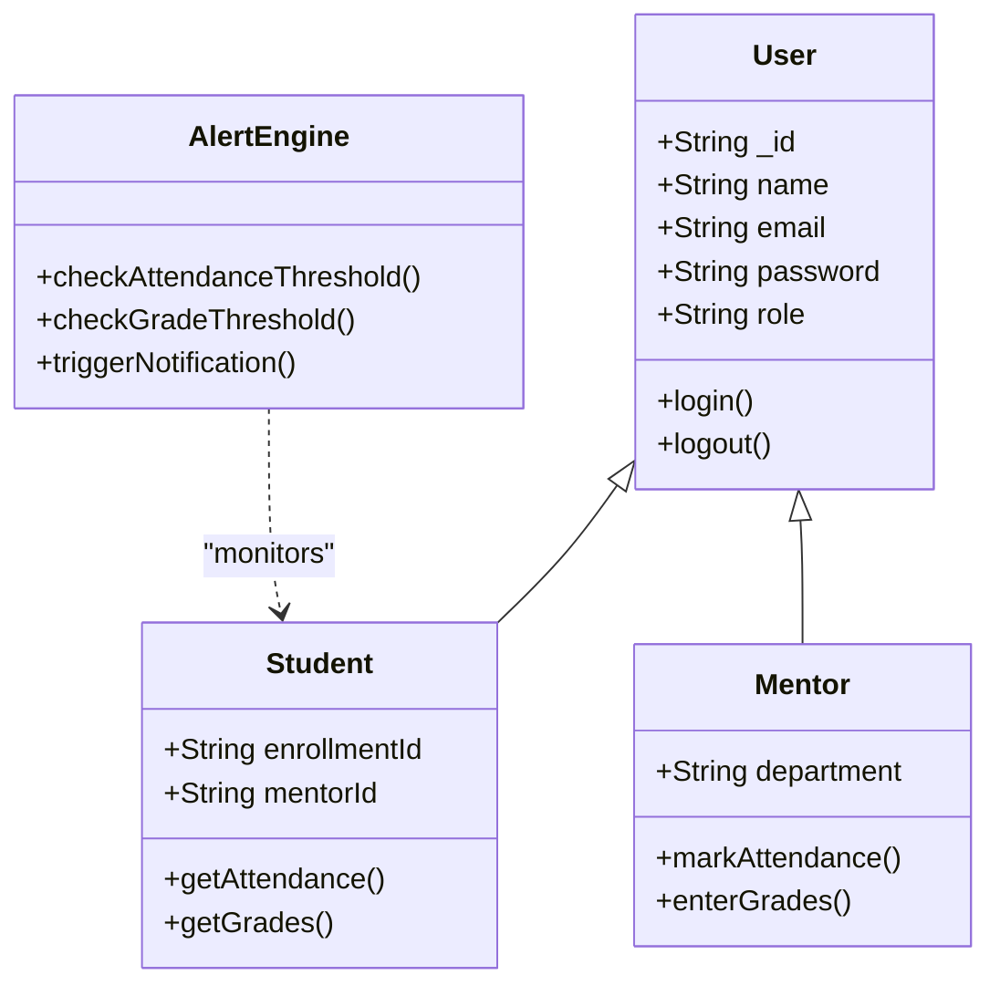
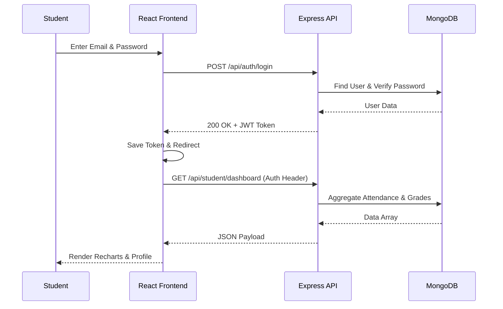
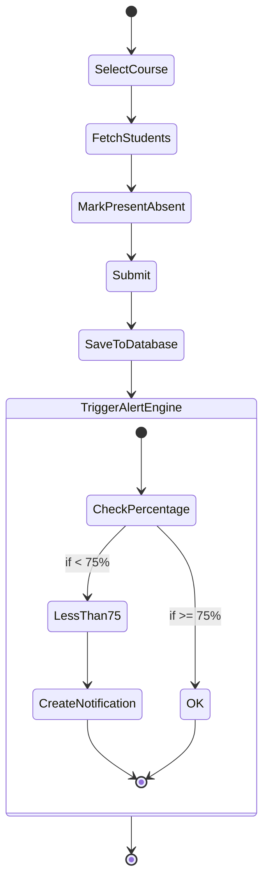

# USIS System Design & UML Diagrams

This document contains the architecture and design diagrams for the Unified Student Information System (USIS) as requested.

## 1. Entity-Relationship (ER) Diagram

## 2. Use Case Diagram

## 3. Data Flow Diagrams (DFD)

### Level 0 (Context Diagram)

### Level 1

### Level 2 (Attendance & Alert Sub-process)

## 4. UML Class Diagram

## 5. Sequence Diagram (Authentication & Dashboard)

## 6. Activity Diagram (Marking Attendance)

